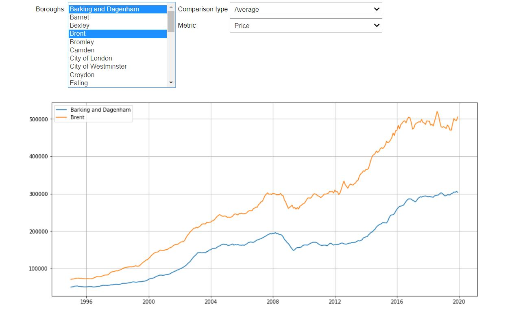

# london-homes
Some tools for looking at the London housing market

## Contents
### HistoricalHousePriceData

Allows comparison of historical house price and volume data between London boroughs.

Can be broken down by:
- Property type (flat/terraced/detached)
- Funding source (cash/mortgage)
- Buyer status (first time buyer/former owner occupier)
- Build status (new/old)

Comparison metrics include:
- Price
- Seasonally adjusted price
- Index (normalised to 100 in Jan 2015)
- Seasonally adjusted index
- Sales volume
- % change in price from previous month
- % change in price from previous year
